#**Traffic Sign Recognition** 

In this project I trained a deep neural network to classify images of german traffic signs as an assignment of the udacity self driving car nanodegree.

---

**Build a Traffic Sign Recognition Project**

The goals / steps of this project are the following:

* Load the data set 
* Explore, summarize and visualize the data set
* Design, train and test a model architecture
* Use the model to make predictions on new images
* Analyze the softmax probabilities of the new images
* Summarize the results with a written report

[//]: # (Image References)

[image1]: ./examples/visualization.jpg "Visualization"
[image2]: ./examples/grayscale.jpg "Grayscaling"
[image3]: ./examples/random_noise.jpg "Random Noise"
[image4]: ./examples/placeholder.png "Traffic Sign 1"
[image5]: ./examples/placeholder.png "Traffic Sign 2"
[image6]: ./examples/placeholder.png "Traffic Sign 3"
[image7]: ./examples/placeholder.png "Traffic Sign 4"
[image8]: ./examples/placeholder.png "Traffic Sign 5"

## Rubric Points
###Here I will consider the [rubric points](https://review.udacity.com/#!/rubrics/481/view) individually and describe how I addressed each point in my implementation.  

---
###Writeup / README

####1. Provide a Writeup / README that includes all the rubric points and how you addressed each one. 

You're reading it! and here is a link to my [project code](https://github.com/FabianHertwig/CarND-Traffic-Sign-Classifier-Project/blob/master/Traffic_Sign_Classifier.ipynb)

###Data Set Summary & Exploration

####1. Provide a basic summary of the data set. In the code, the analysis should be done using python, numpy and/or pandas methods rather than hardcoding results manually.

I used the pandas library to calculate summary statistics of the traffic
signs data set:

* The size of training set is 34799 observations.
* The size of the validation set is 12630 observations.
* The size of test set is 4410 observations.
* The shape of a traffic sign image is 32x32x3
* The number of unique classes/labels in the data set is 43.

####2. Include an exploratory visualization of the dataset.

Here is an exploratory visualization of the data set. There are multiple bar charts showing how the classes are distrubuted for the train, validation and test set.

Class distribution is pretty much the same on each set, though there are more prominent classes than others. To improve results further, one could rebalance the class distribution with augmented images.

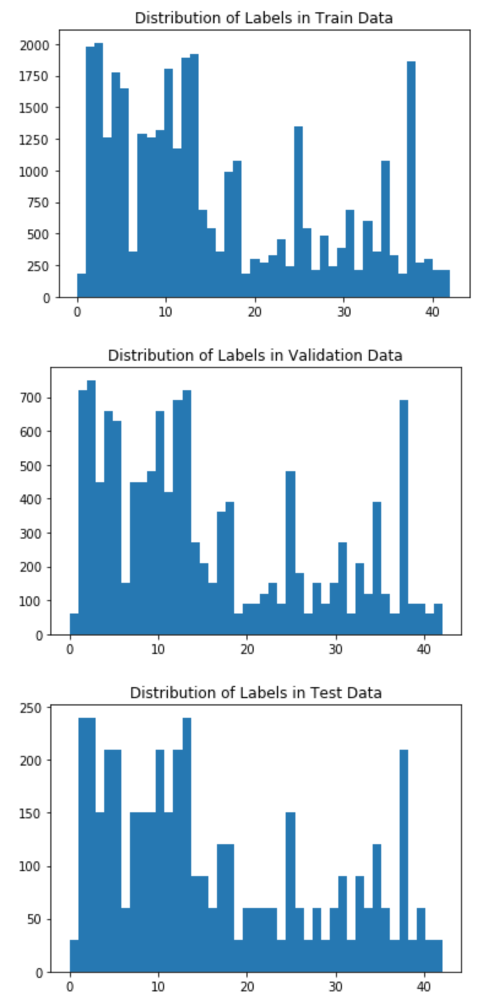

I also plotted some images for each class of the dataset to get an overview of what the images show. This is only a part of the plot, please view the notebook to see all classes.

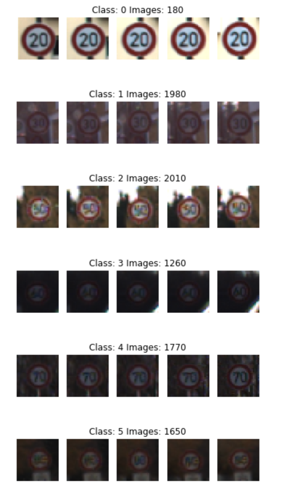

The class distribution seem to be according to the distribution of the signs you see on german streets. For example class one, a speed limit of 20 km/h is very rare to see, as usally the speed limit in residential areas is 30 km/h. So there are only 180 images of this sign. There are up to 2000 images for the "popular" signs.

As far as I know the images were taken from a car and multiple images of each sign were taken as the car moved by. Therfore the dateset contains the same image with different alterations in the angle or in brightness. Lets take a look at random pictures per class to see some different ones. Again, this is only a part of the plot, please view the notebook to see all classes.

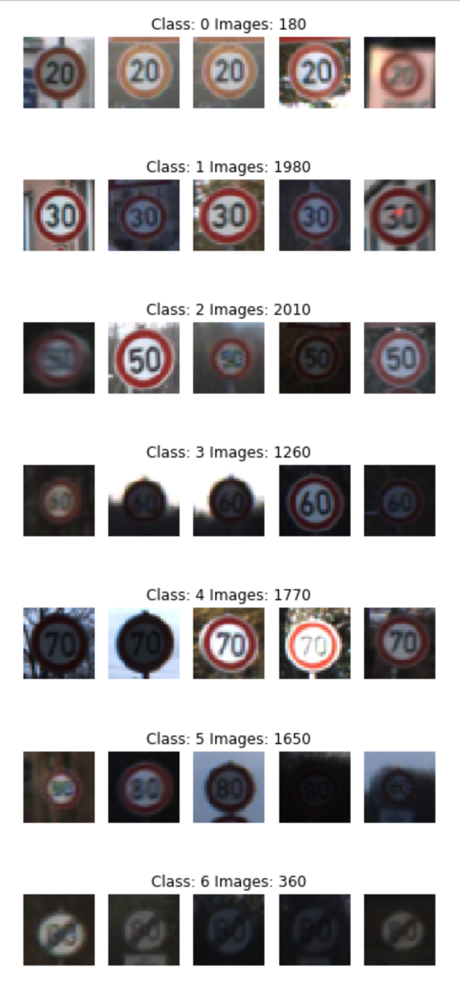

###Design and Test a Model Architecture

####1. Preprocessing and Augmentation

To train the net I prepocessed the images and also added augmented images.

For preprocessing the images are normalized, so every image uses the full brightness spectrum from value 0 to value 255. This improves images that are very dark, but also adds shifts in colour. One could use better techniques to normalize the brightness, as converting in the HSL colorspace and normalize brighntess there. 

Normalizing the images improved the accuracy of the net.

For augmentation random brightness got added and then the images got normalized. Brightness is added before normalizing, to emulate different conditions when the picture was taken. Also random translations, rotations, sheering and scaling were added. These augmentation techniques are used quite often with image recognition tasks and should improve overfitting. For example the  in the famous [ImageNet Classification with Deep Convolutional Neural Networks paper](http://papers.nips.cc/paper/4824-imagenet-classification-with-deep-convolutional-neural-networks) image translations, mirroring and changes in colour were used. I decided not to mirror the images as you would not encounter a mirrored sign in the real world.

At last the image values where converted to a -1.0 to 1.0 range for deep learning.

Following are examples for the augmentations steps.

Original Image:
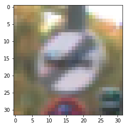

Random Brightness added to the Image:
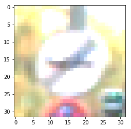

Pixel intensity normalized:

Shear, translation, rotation and scale added to the Image. This is done in one step using a transformation matrix.
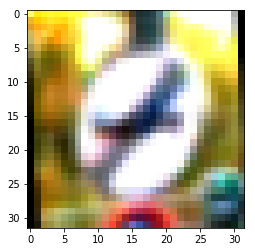

For each image in the original training set I added five augmented images.

Hare are a few more examples:
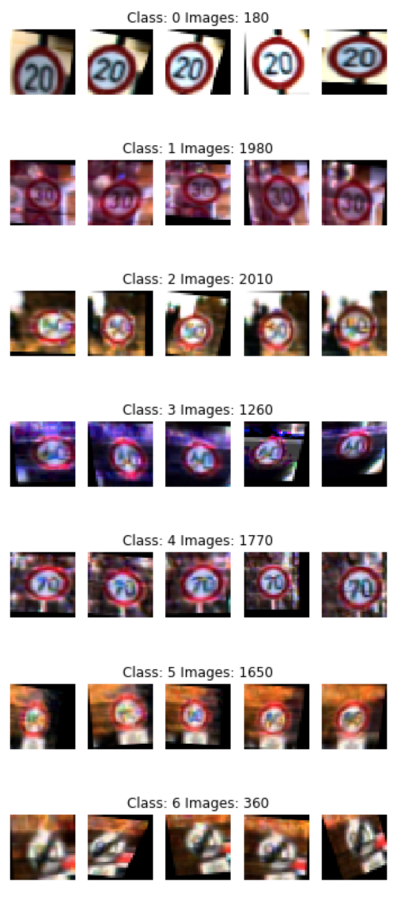

####2. The final model architecture

Below is a table of the architecture. It is the same as the LeNet-5 architecture with more filters and therefore more fully connected nodes.

| Layer           | Description                                 |
|-----------------|---------------------------------------------|
| Input           | 32x32x3 Image Data                          |
| Convolution 5x5 | Valid Padding, 1x1 Strides, 28x28x16 Output |
| Relu            |                                             |
| Max Pool        | 2x2 Strides, 14x14x16 Output                |
| Convolution 5x5 | Valid Padding, 1x1 Strides, 10x10x32 Output |
| Relu            |                                             |
| Max Pool        | 2x2 Strides, 5x5x32 Output                  |
| Flatten         | 800 Output                                  |
| Fully Connected | 200 Output                                  |
| Relu            |                                             |
| Fully Connected | 100 Output                                  |
| Relu            |                                             |
| Dropout         | 50% Keep Probability                        |
| Fully Connected | Output 43                                   |

####3. Hyperparameters and training approach.
I used the same architecture as the LeNet-5 net, as it was build for image classification tasks. Also most of the code got implemented earlier in the nanodegree so it seemed obvious to reuse the code.

To improve the accuracy of the net, I changed increased the filters and therefore I had to increase the number of fully connected neurons accordingly. At first I started with quite deep filters, and a lot of neurons. Then I decreased the filters step by step to prevent overfitting  until I got good results. 

I tried to create an overfitting model first, so I know that the model is able to learn the concepts. Then I tried to decrease overfitting by decreasing filter depths, adding a dropout layer with a 50% keep probability and image augmentation.

I used the adam optimizer with its default learning rate of 0.001. I tried to lower the training rate, but that seemed to increase training time without accuracy improvements. The adam optimizer should addapt the training rate anyways.

I also tried to increase the batch size until I run in memory issues, but that seemed to lower the accuracy somehow. So I kept the batch size at 512. The model ran for 30 Epochs, but it didn't improve after 20.

As a final result I got a validation accuracy of 0.943 and test accuracy of 0.95. 

In the loss chart below you can see that validations loss starts to rise again after about 10 Epochs of training. That shows that the net is still overfitting, but I'm happy with the results it produces anyways.

This are examples for the most confused classes from most confusions to less confusions. The signs are very similiar indeed. 

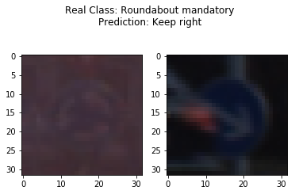
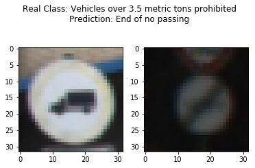
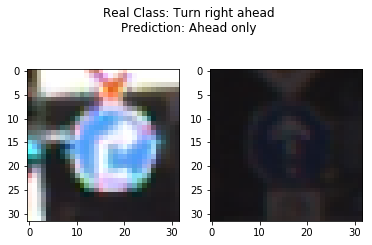
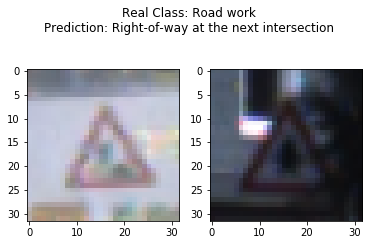
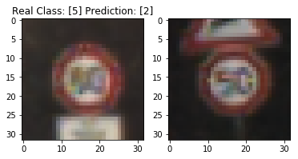

###Test a Model on New Images

####1. Choose five German traffic signs found on the web and provide them in the report. For each image, discuss what quality or qualities might be difficult to classify.

As I life in Germany, I drove around and took some images. I mounted my Phone behind my windshield to take the images. The windscreen was quite dirty, from time to time it was raining. So the images will be challenging. Also there is one 120 km/h speed limit image which was displayed with LEDs and the signs background is black instead of white. Im curious if that one gets recognized by the net.

Here is one example how the image was taken and for the dirty windshield in the corner :)

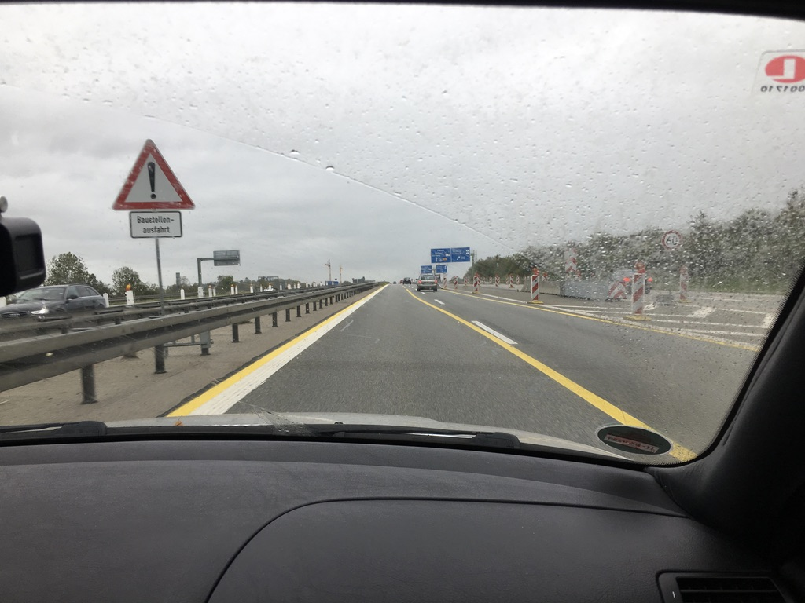

Here are the images I have chosen:

####2. Predictions power on new traffic signs

Here are the results of the prediction:

| True Class            | Prediction            |
|-----------------------|-----------------------|
| Priority road         | Priority road         |
| General caution       | No entry              |
| General caution       | General caution       |
| Speed limit (50km/h)  | Speed limit (50km/h)  |
| Speed limit (60km/h)  | Speed limit (60km/h)  |
| Speed limit (120km/h) | Stop                  |
| Speed limit (120km/h) | Speed limit (120km/h) |

The model confused some of the images. I really don't know how it confused class "General caution" with "No entry". To confuse the very different Speed Limit (120km/h) sign seems reasonable. 

On these images the model got an accuracy of 71% which is worse than on the testset. But these images are harder to classify bacause of the noise added by the rain and there is one sign that the model has never seen before.

####3. Softmax Probabilities

True Class: 12  

| 12   | 26   | 10   | 9    | 32   |
|------|------|------|------|------|
| 1.00 | 0.00 | 0.00 | 0.00 | 0.00 |

True Class: 18  

| 17   | 18   | 31   | 13    | 1   |
|------|------|------|------|------|
| 0.66 | 0.13 | 0.10 | 0.04 | 0.02 |

True Class: 18

| 18   | 1   | 0   | 13    | 31   |
|------|------|------|------|------|
| 0.58 | 0.40 | 0.00 | 0.00 | 0.00 |

True Class: 2

| 2   | 1   | 31   | 21    | 4   |
|------|------|------|------|------|
| 1.00 | 0.00 | 0.00 | 0.00 | 0.00 |

True Class: 3

| 3   | 2   | 23   | 25    | 31   |
|------|------|------|------|------|
| 0.92 | 0.08 | 0.00 | 0.00 | 0.00 |

True Class: 8

| 14   | 5   | 8   | 1    | 7   |
|------|------|------|------|------|
| 0.83 | 0.09 | 0.05 | 0.03 | 0.00 |

True Class: 8

| 8   | 7   | 2   | 5    | 15   |
|------|------|------|------|------|
| 0.96 | 0.03 | 0.02 | 0.00 | 0.00 |

### (Optional) Visualizing the Neural Network (See Step 4 of the Ipython notebook for more details)
####1. Discuss the visual output of your trained network's feature maps. What characteristics did the neural network use to make classifications?

